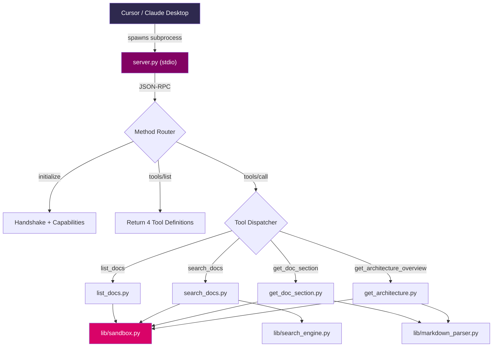

# MCP Documentation Server — DoubleTime

> [!IMPORTANT]
> This plan is for a **Python stdio-based MCP server** that exposes your `Docs/` folder as structured, searchable context to any MCP-compatible client (Cursor, Claude Desktop, custom CLI, etc.).

---

## 0. Docs Layout Audit & Suggested Restructuring

### Current Layout

```
Docs/
├── README.md              (228 B — duplicate sentence, minimal)
├── TODO.md                (14.7 KB — phased task tracker)
├── architecture.md        (8.3 KB — layers, state, folder map)
├── data_flow.md           (9.2 KB — event sequences)
├── spec.md                (8.5 KB — product rules, tech stack)
├── styling.md             (7.3 KB — palette, typography, components)
├── games/
│   ├── blackjack.md       (0 B — empty placeholder)
│   ├── crash.md           (3.4 KB)
│   ├── mines.md           (5.2 KB)
│   ├── plinko.md          (3.5 KB)
│   └── slots.md           (3.5 KB)
├── llms/
│   ├── SwiftUI-LLMs.md    (479 KB — large reference)
│   └── markdown-styling.md (874 B)
└── ui-similar/
    └── ui-similar.md
```

### Suggested Changes

| Change | Why |
|--------|-----|
| Delete or fill `games/blackjack.md` | Empty file pollutes `list_docs` and search results |
| Rename `Docs/README.md` → `Docs/index.md` and rewrite as a **doc map** | The current README is a duplicated 2-liner. An `index.md` that lists every doc with a 1-line summary becomes the canonical entry point for both humans and `get_architecture_overview()` |
| Add YAML frontmatter to every `.md` file | Enables `title`, `category`, `last_updated` metadata that the MCP server can expose without parsing the body. Example below |
| Move `TODO.md` → `Docs/project/TODO.md` | Separate operational docs from specification docs |
| Consider splitting `llms/SwiftUI-LLMs.md` (479 KB) | A 479 KB file is too large for a single MCP response. Either split by topic or add a note in the metadata that the server should chunk it |

### Recommended Frontmatter Format

```yaml
---
title: "Architecture"
category: "core"          # core | games | llms | project | ui-reference
description: "Layer boundaries, state ownership, service responsibilities, and file layout."
last_updated: "2026-02-26"
---
```

> [!TIP]
> Frontmatter is **optional for MVP**. The server will work without it. But adding it later makes `list_docs` and `search_docs` significantly richer.

---

## 1. Architecture Plan

### Transport: **stdio** (not HTTP)

**Justification:**
- MCP's primary integration path (Cursor, Claude Desktop) uses stdio.
- Zero network config, zero auth overhead, zero port conflicts.
- The MCP spec defines stdio as the "local tool" transport.
- HTTP/SSE is only needed for remote servers or multi-client scenarios.

### File/Module Layout

All MCP server code lives in a **new top-level folder** alongside `Docs/`:

```
mcp-docs-server/
├── server.py              # Entry point — stdio loop, MCP handshake, request dispatch
├── tools/
│   ├── __init__.py
│   ├── list_docs.py       # list_docs() implementation
│   ├── search_docs.py     # search_docs() implementation
│   ├── get_doc_section.py # get_doc_section() implementation
│   └── get_architecture.py# get_architecture_overview() implementation
├── lib/
│   ├── __init__.py
│   ├── sandbox.py         # Path validation + traversal prevention
│   ├── markdown_parser.py # Heading extraction, section slicing
│   └── search_engine.py   # Token-based search + TF-IDF-lite ranking
├── tests/
│   ├── test_list_docs.py
│   ├── test_search_docs.py
│   ├── test_get_doc_section.py
│   ├── test_get_architecture.py
│   └── test_sandbox.py
├── client.py              # Tiny CLI client for demo/testing
├── requirements.txt       # Should be empty or near-empty
└── README.md              # Setup + usage instructions
```

### How It Starts and Receives Requests

```
┌─────────────┐  stdin (JSON-RPC)  ┌──────────────┐  dispatch  ┌──────────┐
│  MCP Client │ ──────────────────▶│  server.py   │ ─────────▶│  tools/  │
│  (Cursor)   │ ◀──────────────────│  (stdio)     │ ◀─────────│  lib/    │
└─────────────┘  stdout (JSON-RPC) └──────────────┘           └──────────┘
```

1. Client spawns `python server.py` as a subprocess.
2. Client sends `initialize` request → server responds with capabilities + tool list.
3. Client sends `tools/call` requests → server dispatches to the matching tool module.
4. All I/O is **line-delimited JSON-RPC 2.0** over stdin/stdout.
5. Logging/debug goes to **stderr** (never pollute stdout).

### How Each Tool Works End-to-End

| Tool | Flow |
|------|------|
| `list_docs` | Receive call → `sandbox.resolve(docs_root)` → `os.walk` the docs dir → collect file metadata → return JSON array |
| `search_docs` | Receive call → load all doc contents (cached) → tokenize query → score each doc by TF-IDF-lite → return top_k results with snippets |
| `get_doc_section` | Receive call → `sandbox.resolve(path)` → read file → parse headings → if heading provided, extract that section; if not found, return fuzzy matches → return content |
| `get_architecture_overview` | Receive call → check for `Docs/architecture.md` → if exists, return its contents → if not, scan top-level `.md` files and synthesize a summary |

---

## 2. Tool Specifications

### 2.1 `list_docs`

**Purpose:** Return a manifest of all documentation files.

**Parameters:**
```json
{
  "type": "object",
  "properties": {
    "category": {
      "type": "string",
      "description": "Optional filter by subdirectory name (e.g. 'games', 'llms')"
    }
  },
  "required": []
}
```

**Return Schema:**
```json
{
  "type": "object",
  "properties": {
    "docs_root": { "type": "string" },
    "total": { "type": "integer" },
    "files": {
      "type": "array",
      "items": {
        "type": "object",
        "properties": {
          "path": { "type": "string", "description": "Relative path from docs root" },
          "size_bytes": { "type": "integer" },
          "modified": { "type": "string", "format": "date-time" },
          "title": { "type": "string", "description": "Extracted from first H1 or frontmatter, or filename" },
          "category": { "type": "string", "description": "Subdirectory name or 'root'" }
        }
      }
    }
  }
}
```

**Example Call:**
```json
{
  "jsonrpc": "2.0",
  "id": 1,
  "method": "tools/call",
  "params": {
    "name": "list_docs",
    "arguments": {}
  }
}
```

**Example Response:**
```json
{
  "docs_root": "./Docs",
  "total": 13,
  "files": [
    {
      "path": "architecture.md",
      "size_bytes": 8298,
      "modified": "2026-02-26T18:08:00Z",
      "title": "Architecture",
      "category": "root"
    },
    {
      "path": "games/crash.md",
      "size_bytes": 3434,
      "modified": "2026-02-20T12:00:00Z",
      "title": "Crash Game Rules",
      "category": "games"
    }
  ]
}
```

---

### 2.2 `search_docs`

**Purpose:** Full-text search across all docs with ranked results.

**Parameters:**
```json
{
  "type": "object",
  "properties": {
    "query": {
      "type": "string",
      "description": "Search query (keywords or phrase)"
    },
    "top_k": {
      "type": "integer",
      "description": "Max results to return (default: 5, max: 20)"
    }
  },
  "required": ["query"]
}
```

**Return Schema:**
```json
{
  "type": "object",
  "properties": {
    "query": { "type": "string" },
    "total_matches": { "type": "integer" },
    "results": {
      "type": "array",
      "items": {
        "type": "object",
        "properties": {
          "path": { "type": "string" },
          "title": { "type": "string" },
          "score": { "type": "number" },
          "snippets": {
            "type": "array",
            "items": { "type": "string" },
            "description": "Up to 3 matching text excerpts with context"
          },
          "matched_headings": {
            "type": "array",
            "items": { "type": "string" },
            "description": "Headings in the doc that contain query terms"
          }
        }
      }
    }
  }
}
```

**Example Call:**
```json
{
  "jsonrpc": "2.0",
  "id": 2,
  "method": "tools/call",
  "params": {
    "name": "search_docs",
    "arguments": {
      "query": "remainingMinutes floor rounding",
      "top_k": 3
    }
  }
}
```

**Example Response:**
```json
{
  "query": "remainingMinutes floor rounding",
  "total_matches": 4,
  "results": [
    {
      "path": "spec.md",
      "title": "Goal + Tech Stack + Core Logic",
      "score": 0.87,
      "snippets": [
        "...remainingMinutes = (dailyAllowanceMinutes + bonusMinutesFromGames) - floor(usageMinutesToday)...",
        "...All game outcomes resolve to whole-minute deltas and apply floor rounding only..."
      ],
      "matched_headings": ["Remaining time model", "Game resolution and rounding"]
    },
    {
      "path": "architecture.md",
      "title": "Architecture",
      "score": 0.72,
      "snippets": [
        "...remainingMinutes = (dailyAllowanceMinutes + bonusMinutesFromGames) - floor(usageMinutesToday)..."
      ],
      "matched_headings": ["Remaining Minutes Calculation"]
    }
  ]
}
```

---

### 2.3 `get_doc_section`

**Purpose:** Retrieve a specific section from a doc, or the whole doc if no heading is given.

**Parameters:**
```json
{
  "type": "object",
  "properties": {
    "path": {
      "type": "string",
      "description": "Relative path from docs root (e.g. 'architecture.md', 'games/crash.md')"
    },
    "heading": {
      "type": "string",
      "description": "Optional heading text to extract (e.g. 'State Management'). Case-insensitive partial match."
    }
  },
  "required": ["path"]
}
```

**Return Schema:**
```json
{
  "type": "object",
  "properties": {
    "path": { "type": "string" },
    "heading": { "type": "string", "description": "null if whole doc returned" },
    "content": { "type": "string" },
    "content_length": { "type": "integer" },
    "available_headings": {
      "type": "array",
      "items": { "type": "string" },
      "description": "Returned when heading is not found, for discovery"
    },
    "truncated": { "type": "boolean", "description": "True if content was capped for size" }
  }
}
```

**Example Call (specific section):**
```json
{
  "jsonrpc": "2.0",
  "id": 3,
  "method": "tools/call",
  "params": {
    "name": "get_doc_section",
    "arguments": {
      "path": "architecture.md",
      "heading": "State Management"
    }
  }
}
```

**Example Response (section found):**
```json
{
  "path": "architecture.md",
  "heading": "State Management",
  "content": "State management uses SwiftUI + iOS 17 Observation.\n\n- Global state lives in Core/State as @Observable models.\n- Views consume global state via Environment.\n- Feature ViewModels are thin orchestration layers.\n\n### Global Models\n\nAppModel\n...",
  "content_length": 842,
  "available_headings": null,
  "truncated": false
}
```

**Example Response (heading not found):**
```json
{
  "path": "architecture.md",
  "heading": "databse",
  "content": null,
  "content_length": 0,
  "available_headings": [
    "System Overview",
    "UI Styling Boundary",
    "Folder Structure",
    "Naming Conventions",
    "State Management",
    "Remaining Minutes Calculation",
    "Screen Time Integration",
    "Lock / Unlock Policy and UX",
    "Remaining Minutes Refresh Strategy",
    "Game Architecture",
    "Persistence",
    "Logging",
    "AI Implementation Rules"
  ],
  "truncated": false
}
```

---

### 2.4 `get_architecture_overview`

**Purpose:** Return the canonical architecture document, or synthesize one from top-level docs.

**Parameters:**
```json
{
  "type": "object",
  "properties": {},
  "required": []
}
```

**Return Schema:**
```json
{
  "type": "object",
  "properties": {
    "source": {
      "type": "string",
      "enum": ["canonical", "synthesized"],
      "description": "'canonical' if architecture.md exists, 'synthesized' if auto-generated"
    },
    "content": { "type": "string" },
    "related_docs": {
      "type": "array",
      "items": { "type": "string" },
      "description": "Paths to docs referenced by or related to the architecture"
    },
    "truncated": { "type": "boolean" }
  }
}
```

**Example Response:**
```json
{
  "source": "canonical",
  "content": "# Architecture - Folder Structure, naming conventions, state management\n\nThis document defines how the system is structured...",
  "related_docs": ["spec.md", "data_flow.md", "styling.md"],
  "truncated": false
}
```

---

## 3. Implementation Checklist

### Step 1: Scaffold the Project

- [ ] Create `mcp-docs-server/` at project root
- [ ] Create the directory structure from Section 1
- [ ] Create `requirements.txt` (empty — stdlib only for MVP)
- [ ] Create a minimal `README.md` with setup instructions
- [ ] Verify Python ≥ 3.10 is available (`python3 --version`)

### Step 2: Implement Core Library Modules

- [ ] **`lib/sandbox.py`** — path validation (see pseudocode §4)
- [ ] **`lib/markdown_parser.py`** — heading extraction + section slicing
- [ ] **`lib/search_engine.py`** — tokenizer + TF-IDF-lite scorer

### Step 3: Implement MCP Handshake + Stdio Loop

- [ ] **`server.py`** — JSON-RPC 2.0 reader over stdin
- [ ] Handle `initialize` → respond with `serverInfo` + `capabilities` (tools list)
- [ ] Handle `initialized` notification (no-op ack)
- [ ] Handle `tools/list` → return tool definitions
- [ ] Handle `tools/call` → dispatch to tool handler by name
- [ ] Handle unknown methods → return JSON-RPC error
- [ ] All logging to **stderr**

### Step 4: Implement Each Tool

- [ ] `tools/list_docs.py` — recursive walk + metadata extraction
- [ ] `tools/search_docs.py` — tokenize, score, rank, snippet
- [ ] `tools/get_doc_section.py` — parse headings, extract or fuzzy-match
- [ ] `tools/get_architecture.py` — canonical check, fallback synthesis

### Step 5: Build the CLI Test Client

- [ ] **`client.py`** — spawns `server.py` as subprocess, sends JSON-RPC, prints results
- [ ] Support commands: `list`, `search <query>`, `section <path> [heading]`, `arch`

### Step 6: Write Tests

- [ ] Implement test cases from Section 5
- [ ] Run with `python -m pytest tests/`

### Step 7: Wire into Cursor / Claude Desktop

- [ ] Add server config to `.cursor/mcp.json` or `claude_desktop_config.json`:

```json
{
  "mcpServers": {
    "doubletime-docs": {
      "command": "python3",
      "args": ["mcp-docs-server/server.py"],
      "env": {
        "DOCS_ROOT": "./Docs"
      }
    }
  }
}
```

- [ ] Test with Cursor: ask a question that triggers tool use

### Step 8: Demo Script

- [ ] Run the demo commands from Section 3.1 below

---

### 3.1 Demo Script

```bash
# Terminal 1: Start server manually for debugging
cd /Users/nickwu/Downloads/ProgrammingProjects/CS290/DoubleTime
DOCS_ROOT=./Docs python3 mcp-docs-server/server.py

# Terminal 2: Use the CLI client
python3 mcp-docs-server/client.py list
python3 mcp-docs-server/client.py search "remainingMinutes lock policy"
python3 mcp-docs-server/client.py section architecture.md "Game Architecture"
python3 mcp-docs-server/client.py section games/crash.md
python3 mcp-docs-server/client.py arch
```

**Sample questions to ask the model (via Cursor) once wired:**
1. "What is `remainingMinutes` and how is it calculated?"
2. "Show me the lock/unlock state machine."
3. "What are the rules for the Crash game?"
4. "List all documentation files in the project."
5. "What happens when a game is killed mid-wager?"

---

## 4. Pseudocode

### 4.1 `lib/sandbox.py`

```python
import os

class SandboxError(Exception):
    pass

class Sandbox:
    def __init__(self, docs_root: str):
        # Resolve to absolute, canonical path ONCE at init
        self.root = os.path.realpath(os.path.abspath(docs_root))
        if not os.path.isdir(self.root):
            raise SandboxError(f"Docs root does not exist: {self.root}")

    def resolve(self, relative_path: str) -> str:
        """
        Convert a relative path to an absolute one,
        ensuring it stays within docs_root.
        Raises SandboxError on traversal attempt.
        """
        # Reject obviously bad inputs
        if not relative_path or relative_path.strip() == "":
            raise SandboxError("Empty path")

        # Join and resolve (this collapses ../ etc.)
        candidate = os.path.realpath(
            os.path.join(self.root, relative_path)
        )

        # The critical check: must start with root + separator (or equal root)
        if not (candidate == self.root or
                candidate.startswith(self.root + os.sep)):
            raise SandboxError(
                f"Path traversal blocked: {relative_path}"
            )

        if not os.path.exists(candidate):
            raise SandboxError(f"File not found: {relative_path}")

        return candidate

    def list_all_files(self, extensions=(".md", ".txt")) -> list[dict]:
        """Walk docs root, return metadata for matching files."""
        results = []
        for dirpath, _, filenames in os.walk(self.root):
            for fname in sorted(filenames):
                if not any(fname.endswith(ext) for ext in extensions):
                    continue
                if fname.startswith("."):
                    continue  # skip .DS_Store etc.
                full = os.path.join(dirpath, fname)
                rel = os.path.relpath(full, self.root)
                stat = os.stat(full)
                results.append({
                    "path": rel,
                    "size_bytes": stat.st_size,
                    "modified": stat.st_mtime,  # convert to ISO later
                    "category": self._category(rel),
                })
        return results

    def _category(self, rel_path: str) -> str:
        parts = rel_path.split(os.sep)
        return parts[0] if len(parts) > 1 else "root"
```

---

### 4.2 `lib/markdown_parser.py`

```python
import re

def extract_title(content: str, filename: str) -> str:
    """Extract title from YAML frontmatter or first H1, fallback to filename."""
    # Try frontmatter
    fm_match = re.match(r'^---\s*\n(.*?)\n---', content, re.DOTALL)
    if fm_match:
        for line in fm_match.group(1).split('\n'):
            if line.strip().startswith('title:'):
                return line.split(':', 1)[1].strip().strip('"\'')

    # Try first H1
    h1_match = re.match(r'^#\s+(.+)', content, re.MULTILINE)
    if h1_match:
        return h1_match.group(1).strip()

    # Fallback
    return filename.replace('.md', '').replace('-', ' ').title()


def parse_headings(content: str) -> list[dict]:
    """
    Return list of {level, title, start_line, end_line} for all headings.
    end_line = line before next heading of same or higher level, or EOF.
    """
    lines = content.split('\n')
    headings = []
    for i, line in enumerate(lines):
        match = re.match(r'^(#{1,6})\s+(.+)', line)
        if match:
            headings.append({
                'level': len(match.group(1)),
                'title': match.group(2).strip(),
                'start_line': i,
                'end_line': None,  # filled in next pass
            })

    # Fill end_line: a heading's section ends when a heading of
    # same or higher level appears, or at EOF.
    for idx, h in enumerate(headings):
        for next_h in headings[idx + 1:]:
            if next_h['level'] <= h['level']:
                h['end_line'] = next_h['start_line'] - 1
                break
        if h['end_line'] is None:
            h['end_line'] = len(lines) - 1

    return headings


def extract_section(content: str, heading_query: str) -> tuple[str | None, list[str]]:
    """
    Find section by heading (case-insensitive substring match).
    Returns (section_content, all_heading_titles).
    If no match, returns (None, all_heading_titles) for discovery.
    """
    headings = parse_headings(content)
    all_titles = [h['title'] for h in headings]
    lines = content.split('\n')

    query_lower = heading_query.lower()

    # Exact match first
    for h in headings:
        if h['title'].lower() == query_lower:
            section = '\n'.join(lines[h['start_line']:h['end_line'] + 1])
            return section.strip(), all_titles

    # Substring match
    for h in headings:
        if query_lower in h['title'].lower():
            section = '\n'.join(lines[h['start_line']:h['end_line'] + 1])
            return section.strip(), all_titles

    # No match — return None + all titles for discovery
    return None, all_titles
```

---

### 4.3 `lib/search_engine.py`

```python
import re
import math
from collections import Counter

def tokenize(text: str) -> list[str]:
    """Lowercase, split on non-alphanumeric, drop short tokens."""
    return [t for t in re.split(r'[^a-zA-Z0-9]+', text.lower()) if len(t) >= 2]


class SearchIndex:
    """Lightweight in-memory TF-IDF-style search index."""

    def __init__(self):
        self.docs: dict[str, str] = {}          # path → full content
        self.doc_tokens: dict[str, list[str]] = {}  # path → token list
        self.idf: dict[str, float] = {}

    def add_document(self, path: str, content: str):
        self.docs[path] = content
        self.doc_tokens[path] = tokenize(content)

    def build(self):
        """Compute IDF after all docs are added."""
        n = len(self.docs)
        if n == 0:
            return
        df = Counter()
        for tokens in self.doc_tokens.values():
            unique = set(tokens)
            for t in unique:
                df[t] += 1
        self.idf = {
            t: math.log((n + 1) / (count + 1)) + 1
            for t, count in df.items()
        }

    def search(self, query: str, top_k: int = 5) -> list[dict]:
        query_tokens = tokenize(query)
        if not query_tokens:
            return []

        scores = {}
        for path, doc_tokens in self.doc_tokens.items():
            tf = Counter(doc_tokens)
            doc_len = len(doc_tokens) or 1
            score = 0.0
            for qt in query_tokens:
                if qt in tf:
                    term_tf = tf[qt] / doc_len
                    term_idf = self.idf.get(qt, 1.0)
                    score += term_tf * term_idf
            if score > 0:
                scores[path] = score

        ranked = sorted(scores.items(), key=lambda x: -x[1])[:top_k]

        results = []
        for path, score in ranked:
            snippets = self._extract_snippets(path, query_tokens, max_snippets=3)
            matched_headings = self._matched_headings(path, query_tokens)
            results.append({
                "path": path,
                "score": round(score, 4),
                "snippets": snippets,
                "matched_headings": matched_headings,
            })
        return results

    def _extract_snippets(self, path: str, query_tokens: list[str],
                          max_snippets: int = 3, context_chars: int = 80) -> list[str]:
        content = self.docs[path]
        content_lower = content.lower()
        snippets = []
        seen_positions = set()

        for qt in query_tokens:
            start = 0
            while len(snippets) < max_snippets:
                pos = content_lower.find(qt, start)
                if pos == -1:
                    break
                # Deduplicate overlapping regions
                bucket = pos // context_chars
                if bucket in seen_positions:
                    start = pos + len(qt)
                    continue
                seen_positions.add(bucket)

                snippet_start = max(0, pos - context_chars)
                snippet_end = min(len(content), pos + len(qt) + context_chars)
                snippet = "..." + content[snippet_start:snippet_end].replace('\n', ' ') + "..."
                snippets.append(snippet)
                start = pos + len(qt)

        return snippets[:max_snippets]

    def _matched_headings(self, path: str, query_tokens: list[str]) -> list[str]:
        from lib.markdown_parser import parse_headings
        content = self.docs[path]
        headings = parse_headings(content)
        matched = []
        for h in headings:
            title_lower = h['title'].lower()
            if any(qt in title_lower for qt in query_tokens):
                matched.append(h['title'])
        return matched
```

---

### 4.4 `tools/list_docs.py`

```python
from datetime import datetime, timezone
from lib.sandbox import Sandbox
from lib.markdown_parser import extract_title

def handle(sandbox: Sandbox, arguments: dict) -> dict:
    category_filter = arguments.get("category")
    files = sandbox.list_all_files()

    if category_filter:
        files = [f for f in files if f["category"] == category_filter]

    results = []
    for f in files:
        full_path = sandbox.resolve(f["path"])
        with open(full_path, 'r', encoding='utf-8', errors='replace') as fh:
            content = fh.read(500)  # read only enough for title extraction
        title = extract_title(content, f["path"].split('/')[-1])

        results.append({
            "path": f["path"],
            "size_bytes": f["size_bytes"],
            "modified": datetime.fromtimestamp(
                f["modified"], tz=timezone.utc
            ).isoformat(),
            "title": title,
            "category": f["category"],
        })

    return {
        "docs_root": sandbox.root,
        "total": len(results),
        "files": results,
    }
```

---

### 4.5 `tools/search_docs.py`

```python
from lib.search_engine import SearchIndex
from lib.markdown_parser import extract_title

# Module-level cache (rebuilt per server lifetime)
_index: SearchIndex | None = None

def _ensure_index(sandbox) -> SearchIndex:
    global _index
    if _index is not None:
        return _index

    _index = SearchIndex()
    for f in sandbox.list_all_files():
        full = sandbox.resolve(f["path"])
        with open(full, 'r', encoding='utf-8', errors='replace') as fh:
            content = fh.read()
        _index.add_document(f["path"], content)
    _index.build()
    return _index

def handle(sandbox, arguments: dict) -> dict:
    query = arguments.get("query", "")
    top_k = min(arguments.get("top_k", 5), 20)

    if not query.strip():
        return {"query": query, "total_matches": 0, "results": []}

    index = _ensure_index(sandbox)
    raw_results = index.search(query, top_k=top_k)

    # Enrich with titles
    for r in raw_results:
        full = sandbox.resolve(r["path"])
        with open(full, 'r', encoding='utf-8', errors='replace') as fh:
            content = fh.read(500)
        r["title"] = extract_title(content, r["path"].split('/')[-1])

    return {
        "query": query,
        "total_matches": len(raw_results),
        "results": raw_results,
    }
```

---

### 4.6 `tools/get_doc_section.py`

```python
from lib.sandbox import Sandbox, SandboxError
from lib.markdown_parser import extract_section

MAX_CONTENT_LENGTH = 50_000  # ~50 KB cap per response

def handle(sandbox: Sandbox, arguments: dict) -> dict:
    path = arguments.get("path", "")
    heading = arguments.get("heading")

    try:
        full_path = sandbox.resolve(path)
    except SandboxError as e:
        return {"error": str(e)}

    with open(full_path, 'r', encoding='utf-8', errors='replace') as f:
        content = f.read()

    truncated = False

    if heading:
        section, all_headings = extract_section(content, heading)
        if section is None:
            return {
                "path": path,
                "heading": heading,
                "content": None,
                "content_length": 0,
                "available_headings": all_headings,
                "truncated": False,
            }
        if len(section) > MAX_CONTENT_LENGTH:
            section = section[:MAX_CONTENT_LENGTH]
            truncated = True
        return {
            "path": path,
            "heading": heading,
            "content": section,
            "content_length": len(section),
            "available_headings": None,
            "truncated": truncated,
        }
    else:
        if len(content) > MAX_CONTENT_LENGTH:
            content = content[:MAX_CONTENT_LENGTH]
            truncated = True
        return {
            "path": path,
            "heading": None,
            "content": content,
            "content_length": len(content),
            "available_headings": None,
            "truncated": truncated,
        }
```

---

### 4.7 `tools/get_architecture.py`

```python
from lib.sandbox import Sandbox, SandboxError
from lib.markdown_parser import extract_title

CANONICAL_PATH = "architecture.md"
MAX_CONTENT_LENGTH = 50_000

def handle(sandbox: Sandbox, arguments: dict) -> dict:
    # Try canonical file first
    try:
        full_path = sandbox.resolve(CANONICAL_PATH)
        with open(full_path, 'r', encoding='utf-8', errors='replace') as f:
            content = f.read()

        truncated = len(content) > MAX_CONTENT_LENGTH
        if truncated:
            content = content[:MAX_CONTENT_LENGTH]

        # Identify related docs by scanning for cross-references
        related = _find_related_docs(content)

        return {
            "source": "canonical",
            "content": content,
            "related_docs": related,
            "truncated": truncated,
        }
    except SandboxError:
        pass

    # Fallback: synthesize from top-level docs
    return _synthesize(sandbox)

def _find_related_docs(content: str) -> list[str]:
    """Extract references to other .md files from content."""
    import re
    refs = re.findall(r'(?:Docs/)?(\w[\w/-]*\.md)', content)
    return sorted(set(refs))

def _synthesize(sandbox: Sandbox) -> dict:
    """Build a summary by reading the first heading + first paragraph of each top-level doc."""
    files = sandbox.list_all_files()
    root_docs = [f for f in files if f["category"] == "root"]

    lines = ["# Architecture Overview (Auto-Generated)", ""]
    for f in root_docs:
        full = sandbox.resolve(f["path"])
        with open(full, 'r', encoding='utf-8', errors='replace') as fh:
            content = fh.read(1000)
        title = extract_title(content, f["path"])
        # Get first non-empty, non-heading line as summary
        summary_line = ""
        for line in content.split('\n'):
            stripped = line.strip()
            if stripped and not stripped.startswith('#') and not stripped.startswith('---'):
                summary_line = stripped
                break
        lines.append(f"## {title} (`{f['path']}`)")
        lines.append(summary_line)
        lines.append("")

    return {
        "source": "synthesized",
        "content": '\n'.join(lines),
        "related_docs": [f["path"] for f in root_docs],
        "truncated": False,
    }
```

---

### 4.8 `server.py` (MCP stdio entry point)

```python
#!/usr/bin/env python3
"""
MCP Documentation Server for DoubleTime.
Reads JSON-RPC 2.0 over stdin, writes responses to stdout.
Debug/log output goes to stderr.
"""
import sys
import json
import os

from lib.sandbox import Sandbox, SandboxError
from tools import list_docs, search_docs, get_doc_section, get_architecture

# --- Configuration ---
DOCS_ROOT = os.environ.get("DOCS_ROOT", "./Docs")

# --- Tool Registry ---
TOOLS = {
    "list_docs": {
        "handler": list_docs.handle,
        "description": "List all documentation files with metadata",
        "inputSchema": {
            "type": "object",
            "properties": {
                "category": {
                    "type": "string",
                    "description": "Filter by subdirectory (e.g. 'games', 'llms')"
                }
            },
        },
    },
    "search_docs": {
        "handler": search_docs.handle,
        "description": "Full-text search across documentation",
        "inputSchema": {
            "type": "object",
            "properties": {
                "query": {"type": "string", "description": "Search keywords"},
                "top_k": {"type": "integer", "description": "Max results (default 5)"},
            },
            "required": ["query"],
        },
    },
    "get_doc_section": {
        "handler": get_doc_section.handle,
        "description": "Get a specific section from a doc by heading, or the whole doc",
        "inputSchema": {
            "type": "object",
            "properties": {
                "path": {"type": "string", "description": "Relative path (e.g. 'architecture.md')"},
                "heading": {"type": "string", "description": "Optional heading to extract"},
            },
            "required": ["path"],
        },
    },
    "get_architecture_overview": {
        "handler": get_architecture.handle,
        "description": "Get the architecture overview document or a synthesized summary",
        "inputSchema": {
            "type": "object",
            "properties": {},
        },
    },
}


def log(msg: str):
    """Log to stderr so stdout stays clean for JSON-RPC."""
    print(f"[mcp-docs] {msg}", file=sys.stderr, flush=True)


def send(response: dict):
    """Write JSON-RPC response to stdout."""
    data = json.dumps(response)
    sys.stdout.write(data + "\n")
    sys.stdout.flush()


def handle_initialize(request_id):
    send({
        "jsonrpc": "2.0",
        "id": request_id,
        "result": {
            "protocolVersion": "2024-11-05",
            "serverInfo": {
                "name": "doubletime-docs",
                "version": "0.1.0",
            },
            "capabilities": {
                "tools": {},
            },
        },
    })


def handle_tools_list(request_id):
    tool_defs = []
    for name, spec in TOOLS.items():
        tool_defs.append({
            "name": name,
            "description": spec["description"],
            "inputSchema": spec["inputSchema"],
        })
    send({
        "jsonrpc": "2.0",
        "id": request_id,
        "result": {"tools": tool_defs},
    })


def handle_tools_call(request_id, params, sandbox):
    tool_name = params.get("name")
    arguments = params.get("arguments", {})

    if tool_name not in TOOLS:
        send({
            "jsonrpc": "2.0",
            "id": request_id,
            "error": {
                "code": -32601,
                "message": f"Unknown tool: {tool_name}",
            },
        })
        return

    try:
        result = TOOLS[tool_name]["handler"](sandbox, arguments)
        send({
            "jsonrpc": "2.0",
            "id": request_id,
            "result": {
                "content": [
                    {"type": "text", "text": json.dumps(result, indent=2)}
                ],
            },
        })
    except SandboxError as e:
        send({
            "jsonrpc": "2.0",
            "id": request_id,
            "result": {
                "content": [
                    {"type": "text", "text": json.dumps({"error": str(e)})}
                ],
                "isError": True,
            },
        })
    except Exception as e:
        log(f"Error in {tool_name}: {e}")
        send({
            "jsonrpc": "2.0",
            "id": request_id,
            "error": {
                "code": -32603,
                "message": f"Internal error: {str(e)}",
            },
        })


def main():
    log(f"Starting MCP docs server, DOCS_ROOT={DOCS_ROOT}")
    sandbox = Sandbox(DOCS_ROOT)
    log(f"Sandbox root resolved to: {sandbox.root}")

    for line in sys.stdin:
        line = line.strip()
        if not line:
            continue

        try:
            request = json.loads(line)
        except json.JSONDecodeError as e:
            log(f"Invalid JSON: {e}")
            continue

        method = request.get("method")
        request_id = request.get("id")  # None for notifications
        params = request.get("params", {})

        log(f"← {method} (id={request_id})")

        if method == "initialize":
            handle_initialize(request_id)
        elif method == "initialized":
            # Notification, no response needed
            log("Client initialized")
        elif method == "tools/list":
            handle_tools_list(request_id)
        elif method == "tools/call":
            handle_tools_call(request_id, params, sandbox)
        else:
            if request_id is not None:
                send({
                    "jsonrpc": "2.0",
                    "id": request_id,
                    "error": {
                        "code": -32601,
                        "message": f"Method not found: {method}",
                    },
                })


if __name__ == "__main__":
    main()
```

---

## 5. Tests & Sanity Checks

### 5.1 `test_list_docs.py`

```python
import os, tempfile, json

# Test 1: Lists all .md files recursively
def test_lists_all_md_files():
    """Create a temp docs dir with nested .md files, verify all are returned."""
    # Setup: create docs/a.md, docs/sub/b.md, docs/ignore.txt
    # Call list_docs with no filter
    # Assert: both .md files returned, .txt excluded (unless you support .txt)

# Test 2: Category filter works
def test_category_filter():
    """Create docs/games/crash.md and docs/spec.md.
    Call list_docs(category='games').
    Assert: only crash.md returned."""

# Test 3: Empty docs directory
def test_empty_directory():
    """Point at an empty directory.
    Assert: returns {"total": 0, "files": []}."""

# Test 4: Ignores dotfiles
def test_ignores_dotfiles():
    """Create docs/.DS_Store. Assert it's not in results."""
```

### 5.2 `test_search_docs.py`

```python
# Test 1: Basic keyword match
def test_basic_search():
    """Index two docs. Search for a term in one. Assert it ranks first."""

# Test 2: Multi-word query scores by relevance
def test_multi_word_ranking():
    """Doc A has 'remainingMinutes' once. Doc B has it 5 times.
    Assert Doc B scores higher."""

# Test 3: No results for garbage query
def test_no_results():
    """Search for 'xyzzy123'. Assert empty results list."""

# Test 4: top_k is respected
def test_top_k_limit():
    """Index 10 docs, all matching. Search with top_k=3.
    Assert exactly 3 results returned."""
```

### 5.3 `test_get_doc_section.py`

```python
# Test 1: Exact heading match
def test_exact_heading():
    """Create doc with '## State Management' section.
    Call get_doc_section(path, heading='State Management').
    Assert correct section content returned."""

# Test 2: Heading not found returns available headings
def test_heading_not_found():
    """Search for heading 'Nonexistent'.
    Assert content is None and available_headings is populated."""

# Test 3: No heading returns full doc
def test_full_doc():
    """Call without heading arg. Assert entire file content returned."""

# Test 4: Partial/substring heading match
def test_partial_heading():
    """Doc has '## Lock / Unlock Policy and UX'.
    Search for 'lock policy'. Assert it matches."""
```

### 5.4 `test_get_architecture.py`

```python
# Test 1: Canonical file found
def test_canonical_found():
    """Have architecture.md in docs root.
    Assert source == 'canonical' and content matches file."""

# Test 2: No architecture.md → synthesized
def test_synthesized_fallback():
    """Remove architecture.md. Assert source == 'synthesized'
    and content includes summaries of other docs."""

# Test 3: Related docs extraction
def test_related_docs():
    """architecture.md references spec.md and data_flow.md.
    Assert those appear in related_docs."""
```

### 5.5 `test_sandbox.py` — Path Traversal

```python
# Test 1: ../etc/passwd blocked
def test_parent_traversal():
    """sandbox.resolve('../etc/passwd') → SandboxError."""

# Test 2: Absolute path blocked
def test_absolute_path():
    """sandbox.resolve('/etc/passwd') → SandboxError."""

# Test 3: Encoded traversal blocked
def test_symlink_traversal():
    """Create a symlink inside docs root pointing outside.
    sandbox.resolve('evil_link') → SandboxError
    (because os.path.realpath follows the symlink)."""

# Test 4: Valid nested path works
def test_valid_nested_path():
    """sandbox.resolve('games/crash.md') → returns full path, no error."""

# Test 5: Null bytes blocked
def test_null_byte():
    """sandbox.resolve('file\x00.md') → should not resolve to anything valid."""
```

---

## 6. Gotchas

### 6.1 Common MCP Server Mistakes

| Mistake | Consequence | Fix |
|---------|-------------|-----|
| **Printing debug to stdout** | Corrupts JSON-RPC stream, client can't parse | All logging → `stderr` |
| **Not flushing stdout** | Client hangs waiting for response | Always `sys.stdout.flush()` after every write |
| **Missing `protocolVersion` in initialize response** | Client rejects server | Include `"protocolVersion": "2024-11-05"` |
| **Returning bare result instead of `content` array** | Cursor/Claude can't render the response | Wrap in `{"content": [{"type": "text", "text": "..."}]}` |
| **Not handling `initialized` notification** | Client may stall after handshake | Accept it as a no-op (no response needed) |
| **Forgetting JSON-RPC `id` field** | Notification vs request confusion | Always echo back the `id` for requests; never send `id` for notifications |
| **Large responses (>1MB)** | Client may truncate or OOM | Cap content with `MAX_CONTENT_LENGTH` and set `truncated: true` |

### 6.2 Keeping Responses Deterministic and Safe

| Principle | Implementation |
|-----------|---------------|
| **Deterministic file ordering** | Always `sorted()` when walking directories |
| **Deterministic search ranking** | Break TF-IDF ties by file path (alphabetical) |
| **No side effects** | Tools are read-only. No writes, no deletes, no network |
| **Sandboxed paths** | Every tool resolves paths through `Sandbox.resolve()` |
| **Consistent encoding** | Always `utf-8` with `errors='replace'` to handle binary |
| **Idempotent** | Same inputs → same outputs. No mutable state between calls (index is rebuilt from files) |
| **Content capping** | 50 KB max per response. Large files (like `SwiftUI-LLMs.md` at 479 KB) get truncated |
| **No eval/exec** | Never execute content from docs. Pure text processing only |

### 6.3 DoubleTime-Specific Gotchas

| Issue | Detail |
|-------|--------|
| **`SwiftUI-LLMs.md` is 479 KB** | Way too large for a single tool response. The server caps at 50 KB. Consider splitting it, or add pagination to `get_doc_section`. |
| **`blackjack.md` is empty (0 bytes)** | Will appear in `list_docs` but provide no value. Delete it or add content. |
| **`Docs/README.md` has duplicate lines** | Lines 3-4 and 5-6 are identical. Fix it or replace with `index.md`. |
| **No `.txt` files currently exist** | The server supports `.txt` by default but you have none. Not a problem, just no-ops. |
| **Cross-references use `Docs/` prefix** | Architecture.md references `Docs/styling.md`. The sandbox path is relative to `Docs/`, so the server should strip the `Docs/` prefix when matching references. Handle in `_find_related_docs()`. |

---

## Summary Diagram


